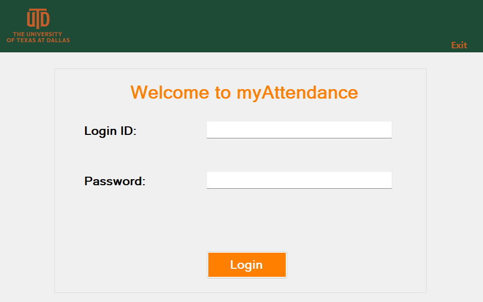
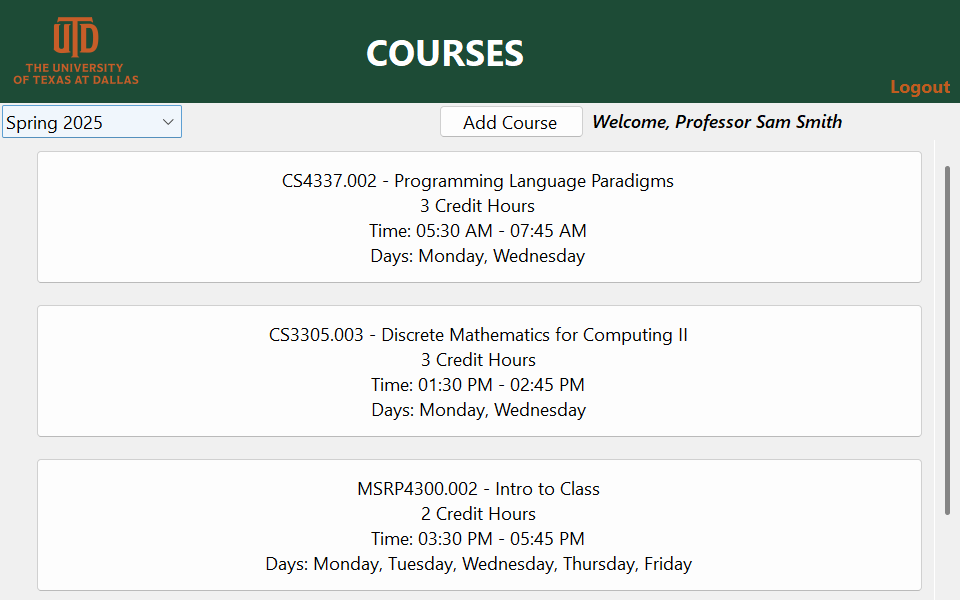
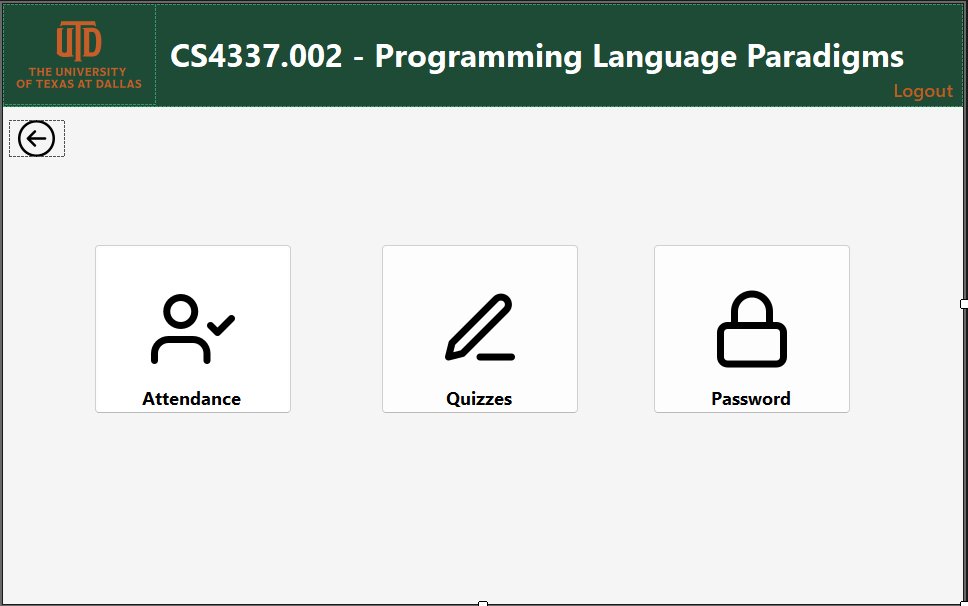
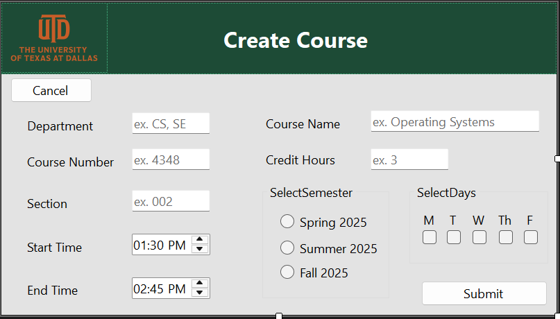
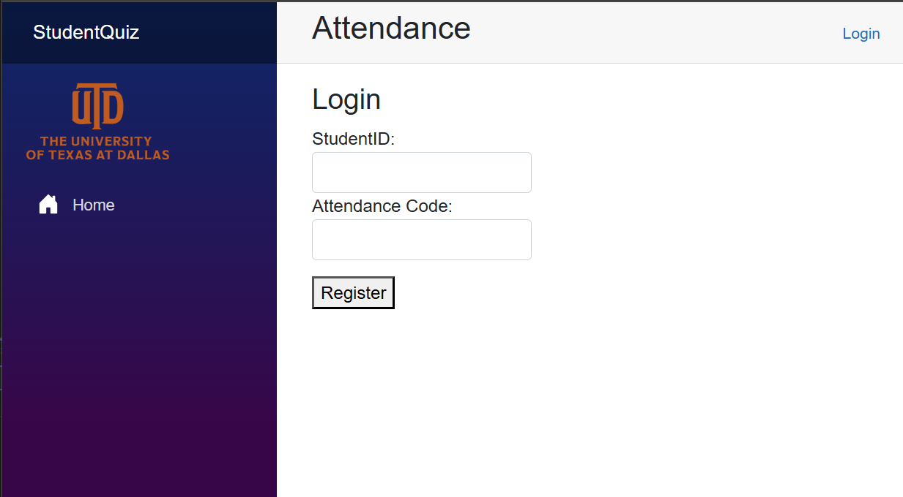
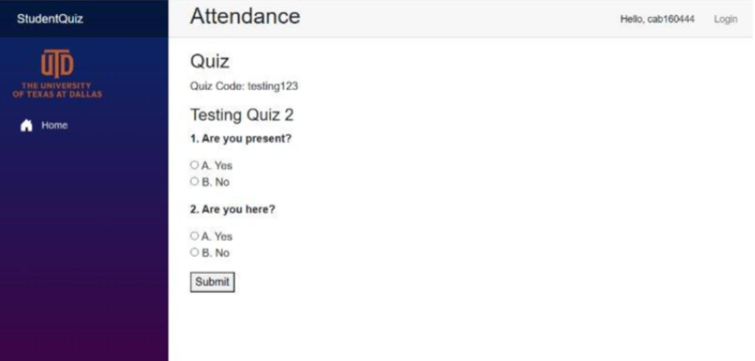

#  :bookmark_tabs: Web-Based Attendance Management System
An attendance management system composed of a web-based student portal paired with a desktop app for professors. 

#### Features Include : 
- Secure login for both students and professors  
- Course management (create, view, and edit courses) for professors
- Quiz creation and management for each course
- CSV import to upload class rosters via the desktop app
- Attendance tracking tied to daily quiz/password entry
- Quiz submission records student IP to prevent duplicate or fraudulent submissions
- Late / excused absence handling  
- Attendance reports exportable for professor review  

## :hammer_and_wrench: Tools & Technologies
- **Languages:** C#, SQL  
- **Frameworks:** WinForms, Blazor  
- **Database:** Azure SQL, DBeaver (for management)  
- **Version Control:** GitHub  
- **IDE:** Visual Studio

## :bulb: Why Create Such A System?
Professors at The University of Texas at Dallas (UTD) lack an efficient system to mark students present for their course. Some resort to swiping student identification cards at the beginning of the course but this method can waste significant class time in courses with 40+ students while requiring additional professor attention for late arrivals. The competing method on campus includes creating attendance quizzes on eLearning (the UTD preferred learning platform for course management), yet this method can clutter eLearning with 25+ assignments all dedicated to attendance.

With a web-based system tied to a desktop app, professors will be able to take accurate attendance without eating up class time or cluttering their eLearning. With the added features mentioned previously!
 
 

##  :computer: Professor Desktop App 
### Built with: WinForms, C#

*Figure 1. Professor Login Screen*

 

*Figure 2. Courses Overview Screen*

 

*Figure 3. Course Home Screen*

 

*Figure 4. Create Course Form*

 

##  :globe_with_meridians: Student Web Browser Page 
### Built with Blazor, C#
- :computer: Students log in securely with UTD credentials  
- :calendar: Professors post daily attendance quizzes  
- :clock4: Attendance submissions tied to session times  
- :link: Synced with the professor’s desktop app  

*Figure 5. Student Login Screen*

 

*Figure 6. Sample Student Quiz Page*

 

## :cloud::no_entry_sign: Azure SQL Cloud Database Discontinued
This system was originally deployed with an **Azure SQL Cloud Database**, which has since been discontinued/deleted (as of May 2025) due to hosting costs.  

The front-end (WinForms desktop app + Blazor web app) code remains available in this repository for review, but the system cannot be run without re-establishing a backend database connection.  

This project is preserved for **portfolio and academic purposes**.
